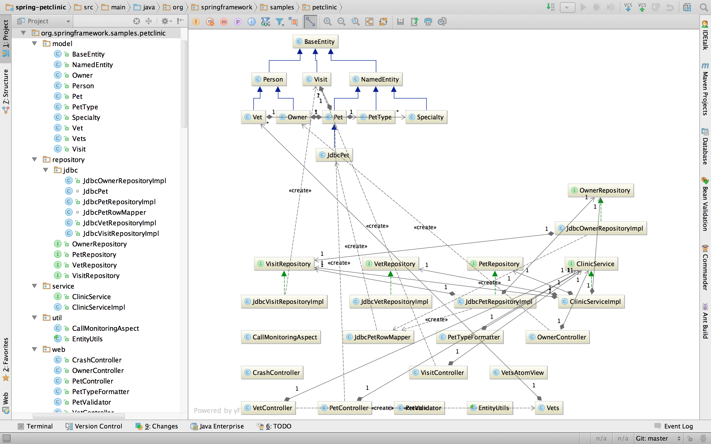
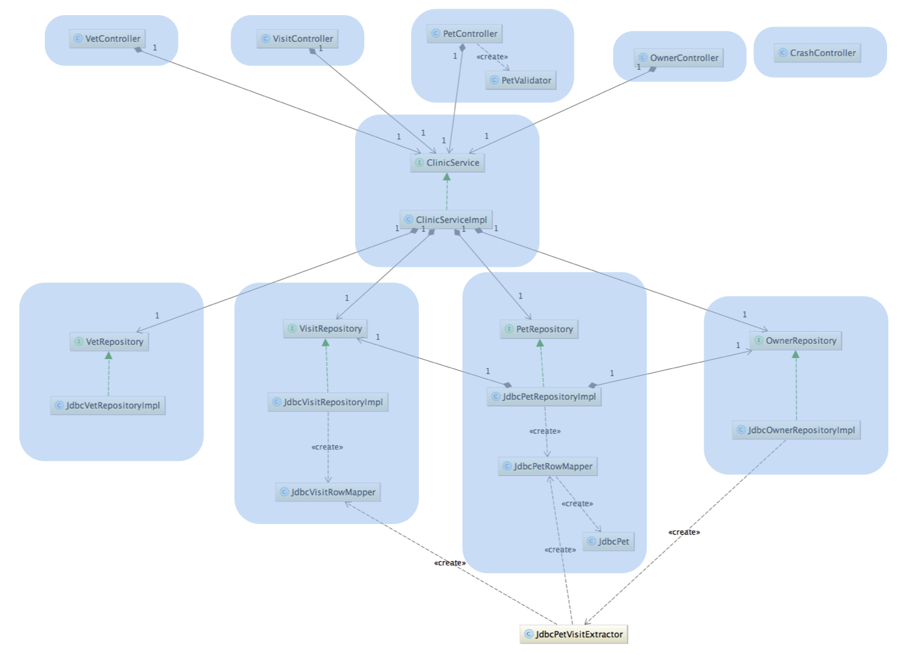
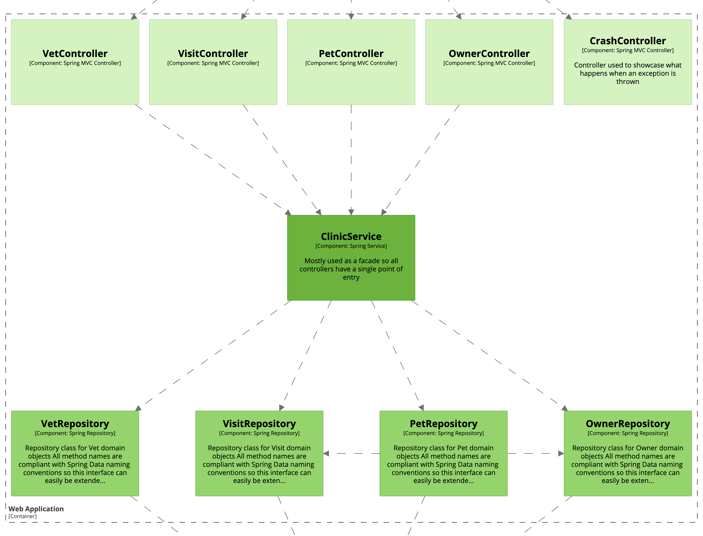

# 컴포넌트

"컴포넌트"라는 단어는 소프트웨어 개발 업계에서 엄청나게 많이 사용되는 용어입니다. 하지만, C4 모델에서 컴포넌트는 잘 정의된 인터페이스 뒤에 캡슐화된 관련 기능들의 그룹을 의미합니다.
Java나 C#과 같은 언어를 사용하고 있다면, 컴포넌트를 생각하는 가장 간단한 방법은 인터페이스 뒤에 있는 구현 클래스들의 모음이라고 생각하는 것입니다.

C4 모델에서 컴포넌트는 별도로 배포할 수 있는 단위가 _아닙니다_. 배포할 수 있는 단위는 컨테이너입니다.
다시 말해, 컨테이너 내의 모든 컴포넌트는 동일한 프로세스 공간에서 실행됩니다. 컴포넌트가 어떻게 패키징되는지(예: JAR 파일, DLL, 공유 라이브러리 등에 하나의 컴포넌트 vs 여러 컴포넌트)와 같은 측면은 별개의 문제입니다.

## 컴포넌트 vs 코드?

컴포넌트는 사용 중인 프로그래밍 언어의 코드 수준 구성 요소에서 한 단계 위로 추상화하는 방법입니다. 예를 들면,

- **객체 지향 프로그래밍 언어(예: Java, C#, C++ 등)**: 컴포넌트는 클래스와 인터페이스로 구성됩니다.
- **절차적 프로그래밍 언어(예: C)**: 컴포넌트는 특정 디렉터리에 있는 여러 C 파일로 구성될 수 있습니다.
- **자바스크립트**: 컴포넌트는 여러 객체와 함수로 구성된 자바스크립트 모듈일 수 있습니다.
- **함수형 프로그래밍 언어**: 컴포넌트는 연관된 함수, 타입 등의 논리적 그룹인 모듈(F#, Haskell 등과 같은 언어에서 지원하는 개념)일 수 있습니다.

객체 지향 프로그래밍 언어를 사용하고 있다면, 컴포넌트는 하나 이상의 클래스를 사용하여 구현됩니다. 코드 맥락에서 컴포넌트가 무엇인지 더 잘 정의하기 위해 간단한 예를 살펴보겠습니다.

[스프링 펫 클리닉(Spring PetClinic)](https://github.com/spring-projects/spring-petclinic)은 Spring MVC 프레임워크를 사용하여 자바 웹 애플리케이션을 구축하는 방법을 보여주는 샘플 코드 베이스입니다.
비기술적 관점에서 보면, 이 시스템은 가상의 동물 병원에서 반려동물과 주인들의 정보, 병원 방문 기록, 그리고 근무 중인 수의사들에 대한 데이터를 관리하기 위해 만들어진 소프트웨어 시스템입니다.
이 시스템은 클리닉 직원들만 사용하도록 설계되었습니다. 기술적 관점에서 보면, 스프링 펫클리닉 시스템은 웹 애플리케이션과 관계형 데이터베이스 스키마로 구성됩니다.

여기서 살펴볼 웹 애플리케이션 버전1은 웹 MVC 컨트롤러, "비즈니스 로직"이 포함된 서비스, 그리고 데이터 액세스를 위한 레포지토리로 구성된 전형적인 계층화된 아키텍처입니다. 도메인 및 유틸 클래스도 있습니다.
깃헙 저장소2의 복사본을 다운로드하고, 선호하는 IDE에서 열어 코드로부터 UML 클래스 다이어그램을 리버스 엔지니어링해 시각화하면, 다음과 같은 결과를 얻을 수 있습니다.

예상하셨겠지만, 이 다이어그램은 스프링 펫 클리닉 웹 애플리케이션을 구성하는 모든 자바 클래스와 인터페이스, 그리고 그들 사이의 모든 관계를 보여줍니다.
프로퍼티와 메서드는 그림에 너무 많은 복잡성을 추가하기 때문에 다이어그램에서 숨겨져 있습니다.
이 코드 베이스는 전혀 복잡하지 않지만, 클래스와 인터페이스를 모두 보여줌으로써 다이어그램이 너무 많은 세부 정보를 표시하고 있습니다.

시스템에 대한 "아키텍처" 논의에 있어 유용하지 않은 클래스들을 제거해 봅시다.
다시 말해, 정적 구조 관점에서 중요한 클래스/인터페이스만 표시해 보겠습니다.
구체적으로는, 이 특정 코드 베이스에서는 (단순 데이터 구조인) 모델/도메인 클래스와 유틸 클래스를 제외하는 것을 의미합니다.

약간의 재배치 후, 이제 소프트웨어 아키텍처에 대해 논의하기 위한 더 간단한 다이어그램을 갖게 되었습니다.
또한 아키텍처 계층(컨트롤러, 서비스 및 저장소)도 다시 볼 수 있습니다.
하지만, 이 다이어그램은 여전히 _코드 수준 요소_(즉, 클래스와 인터페이스)를 보여주고 있습니다.
한 단계 위로 확대하기 위해서는, 이러한 코드 수준 요소 중 어떤 것들이 함께 그룹화되어 "컴포넌트"를 형성할 수 있는지 파악해야 합니다.
코드 수준 요소를 컴포넌트로 그룹화하는 전략은 코드 베이스마다 다를 수 있지만, 이 코드 베이스의 경우 전략은 다음과 같을 수 있습니다.

파란색 상자들은 각각 이 코드 베이스의 "컴포넌트"를 나타냅니다.
요약하자면, 각 웹 컨트롤러는 별도의 컴포넌트이며, 나머지 인터페이스와 그 구현 클래스들을 결합한 결과도 컴포넌트입니다.
코드 수준의 복잡성을 제거하면, 이와 같은 그림을 얻게 됩니다.

본질적으로, 우리는 연관된 기능의 단위를 형성하기 위해 클래스와 인터페이스를 컴포넌트로 그룹화하고 있습니다.
예시의 `JdbcPetVisitExtractor`처럼 많은 컴포넌트에서 사용되는 공유 코드(예: 추상 기본 클래스, 지원 클래스, 헬퍼 클래스, 유틸리티 클래스 등)가 있을 것입니다.
일부는 리팩토링하여 특정 컴포넌트 "내부"로 옮길 수 있지만, 일부는 불가피하게 공유될 수밖에 없습니다.

이 예시는 전통적인 계층형 아키텍처를 보여주지만, 같은 원칙은 코드를 어떻게 패키징하든(예: 계층별, 기능별, 컴포넌트별) 또는 사용 중인 아키텍처 스타일에 관계없이(예: 계층형, 헥사고날, 포트 및 어댑터 등) 적용 가능합니다.
코드 베이스가 충분히 작다면, 이 과정을 수동으로 진행할 수 있습니다. 하지만 더 큰 코드 베이스의 경우, 코드 베이스를 리버스 엔지니어링하여 컴포넌트 다이어그램을 자동으로 생성하는 것을 고려해야 할 것입니다([예시](https://github.com/structurizr/java/blob/master/structurizr-dsl/src/test/resources/dsl/spring-petclinic/workspace.dsl))

- 1 여기에 표시된 다이어그램은 최신 버전의 스프링 펫클리닉을 반영하지 않지만, 논의하기에는 충분합니다.
- 2 `git checkout 95de1d9f8bf63560915331664b27a4a75ce1f1f6`는 이 다이어그램이 기반으로 한 버전입니다.

## FAQ

### Java JAR, C# 어셈블리, DLL, 모듈, 패키지, 네임스페이스, 폴더 등이 컴포넌트인가요?

그럴 수도 있지만, 일반적으로는 그렇지 않습니다.
C4 모델은 런타임 단위(컨테이너)와 기능이 이들 사이에 어떻게 분할되는지(컴포넌트)를 보여주는 것이지, Java JAR 파일, C# 어셈블리, DLL, 모듈, 패키지, 네임스페이스 또는 폴더 구조와 같은 조직적 단위를 보여주는 것이 아닙니다.

물론, 이러한 구조와 컴포넌트 사이에 일대일 매핑이 있을 수 있습니다.
예를 들어, 헥사고날 아키텍처를 구축하는 경우, 컴포넌트당 하나의 Java JAR 파일이나 C# 어셈블리를 만들 수 있습니다.
반면에, 하나의 컴포넌트가 여러 JAR 파일의 코드를 사용하여 구현될 수도 있는데, 이는 서드파티 프레임워크/라이브러리를 고려하고 그것들이 코드 베이스에 어떻게 포함되는지 생각하기 시작할 때 일반적으로 발생하는 일입니다.
