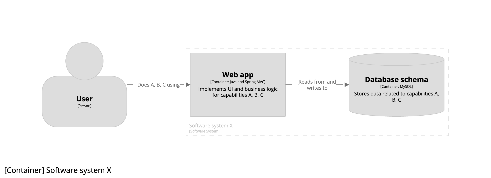
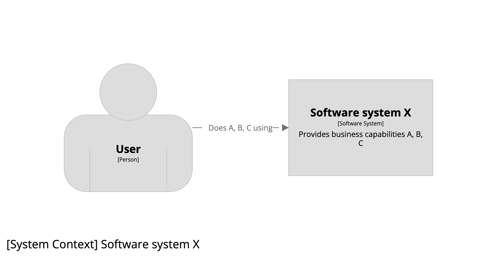
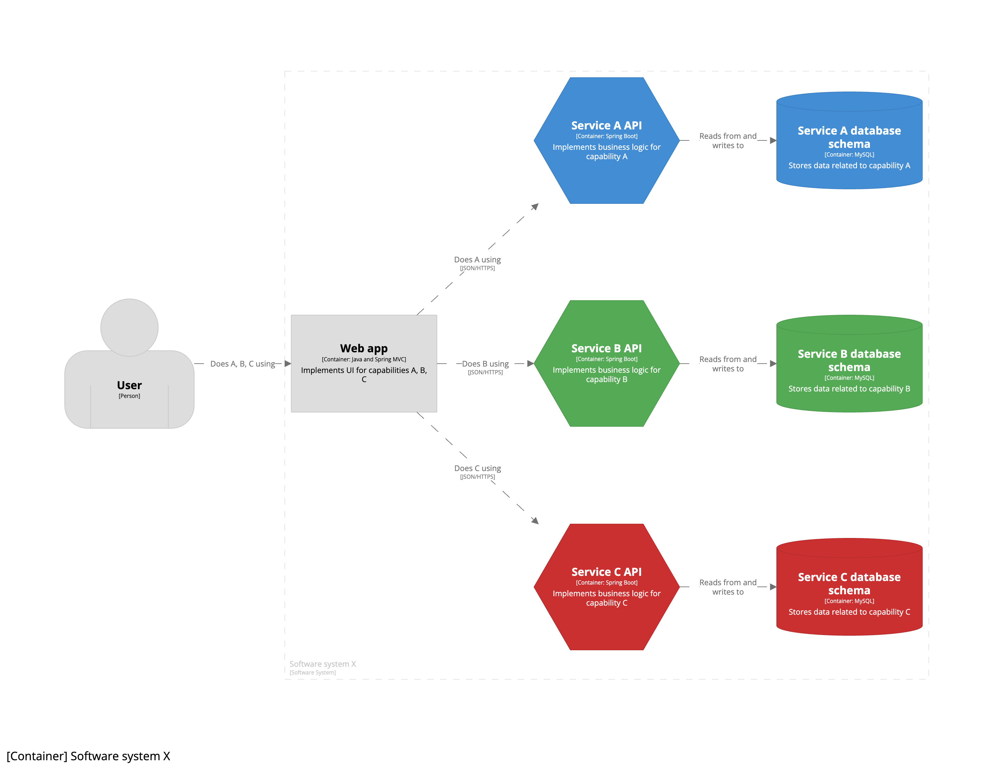
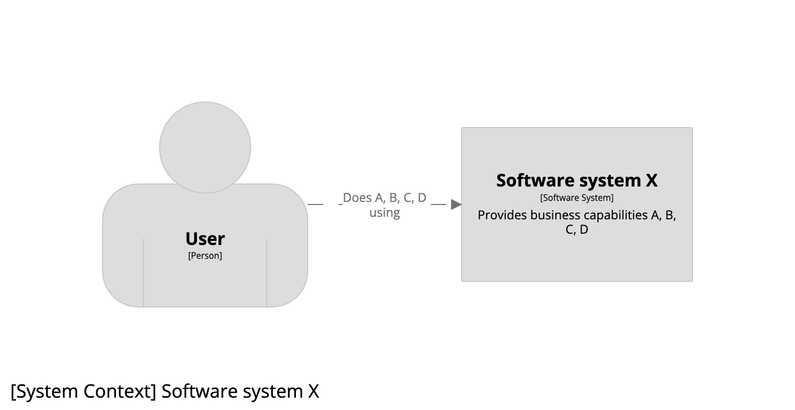
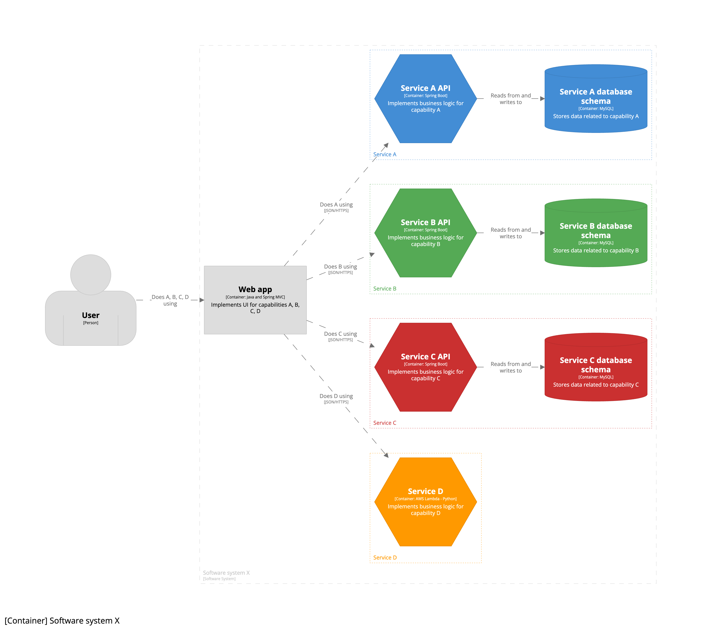
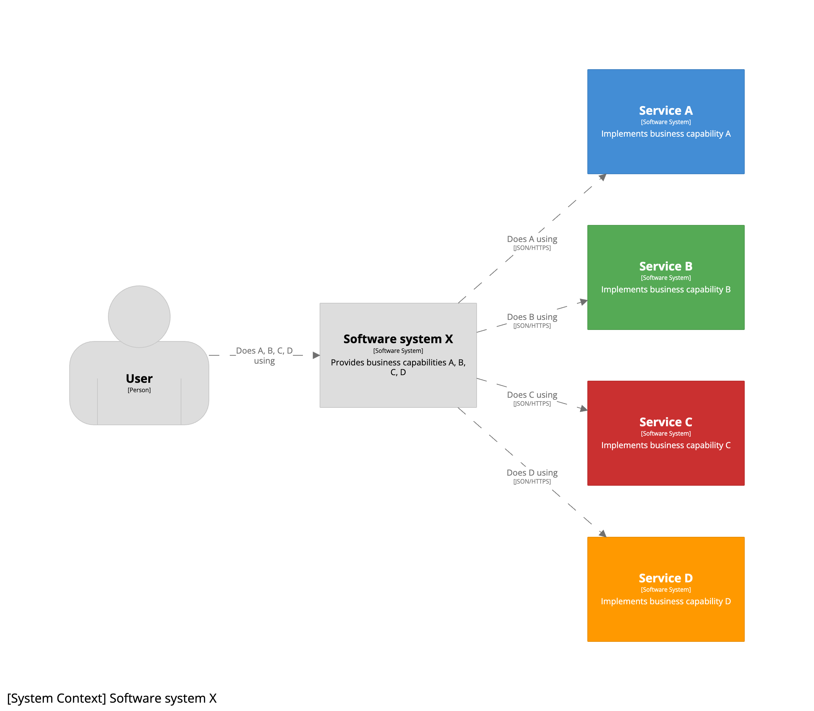
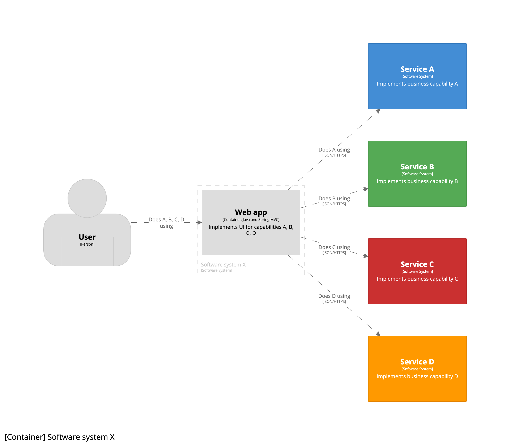
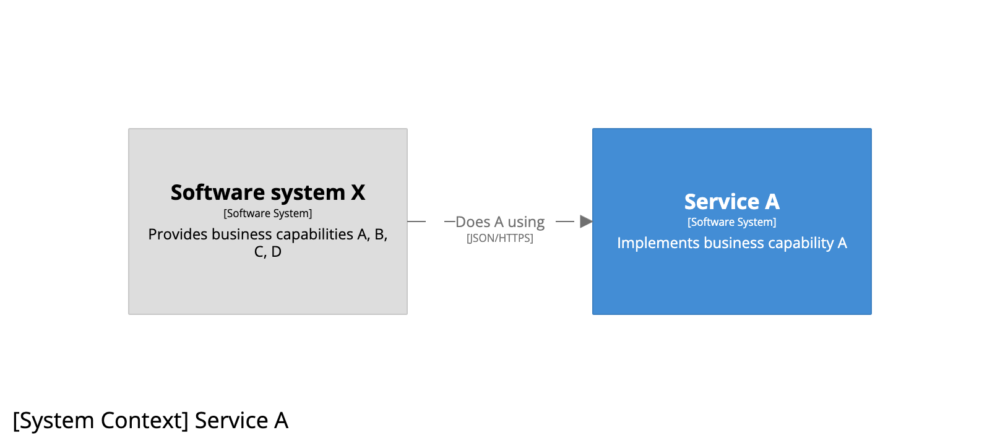
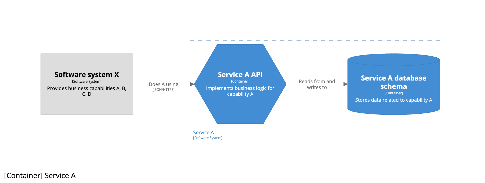

# 마이크로서비스

“마이크로서비스”가 무엇을 의미하는지에 따라 다르지만 C4 모델을 사용하여 마이크로서비스를 다이어그램으로 표현하는 데는 크게 두 가지 방법이 있습니다. 이를 염두에 두고 처음부터 차근차근 살펴보겠습니다.

## 1 단계 - 모놀리식 아키텍처 스타일

<!--"비즈니스 기능(business function)"과 구분되어야 하기 때문에 "비즈니스 역량(business capabilities))으로 번역하였습니다. 또한 비즈니스 모델과 관련된 글들에서 "비즈니스 역량"으로 번역되고 있었습니다.
참고: https://bizzdesign.com/blog/why-business-capabilities-are-key-in-business-architecture/-->

우리가 현금이 부족한 소규모 스타트업에서 일하고 있으며, 우리의 임무는 고객에게 비즈니스 역량(business capabilities) A, B, C를 제공하는 "X"라는 이름의 소프트웨어 시스템을 구축하는 것이라 가정해 보겠습니다. 시스템 컨텍스트 다이어그램은 다음과 같습니다.

특히 소규모 엔지니어링 팀을 가진 자금이 부족한 스타트업이 무언가를 빠르고 저렴하게 제공하는 가장 좋은 방법은 단일 모놀리식 데이터베이스 스키마에서 읽고 쓰는 단일 모놀리식 웹 애플리케이션으로 구성된 모놀리식 아키텍처를 사용하는 것입니다. 결과적으로 컨테이너 다이어그램은 다음과 같게 됩니다.

## 2 단계 - 마이크로서비스 아키텍처 스타일

그로부터 수 년이 지나 유료 고객이 생겼고, 트래픽이 증가하기 시작했으며, 엔지니어를 몇 명 더 고용했고, 코드베이스가 점차 커졌습니다. 모놀리식 아키텍처로 인해 속도가 느려지기 시작했고, 마이크로서비스 아키텍처로 전환하기로 결정했습니다. 여기서 말하는 마이크로서비스란 무엇일까요?

이 질문에 답하기 위해 제임스 루이스와 마틴 파울러가 쓴 [Microservices](https://martinfowler.com/articles/microservices.html)를 참고해보겠습니다.

> 간단히 말해, 마이크로서비스 아키텍처 스타일은 하나의 애플리케이션을 여러 작은 서비스의 모음으로 개발하는 접근 방식으로, 각 서비스는 자체 프로세스에서 실행되고 가벼운 메커니즘(주로 HTTP 리소스 API)과 통신합니다. 이러한 서비스는 비즈니스 역량에 따라 구축되며 완전 자동화된 배포 메커니즘을 통해 독립적으로 배포할 수 있습니다.

이를 C4 모델에 맞게 설명하기 위해 "애플리케이션"을 "소프트웨어 시스템"으로 대체해 보겠습니다.

> 즉, 마이크로서비스 아키텍처 스타일은 하나의 **소프트웨어 시스템**을 여러 작은 서비스의 모음으로 개발하는 접근 방식으로, 각 서비스는 자체 프로세스에서 실행되고 가벼운 메커니즘(주로 HTTP 리소스 API)과 통신합니다. 이러한 서비스는 비즈니스 역량에 따라 구축되며 완전 자동화된 배포 메커니즘을 통해 독립적으로 배포할 수 있습니다.

이 스타트업의 성장 단계에서는 엔지니어를 몇 명 더 고용했지만 단일 팀으로 유지하기로 결정했습니다. 시스템 컨텍스트 다이어그램은 그대로 유지됩니다.

하지만 컨테이너 다이어그램은 변경되었습니다. 기존 웹 애플리케이션의 단일 모놀리식 UI를 유지하되 비즈니스 로직과 데이터를 개별 마이크로서비스로 옮기기로 결정했습니다. 이제 컨테이너 다이어그램은 다음과 같습니다.

저희는 여전히 하나의 엔지니어링 팀으로 구성되어 있기 때문에 마이크로서비스 아키텍처로의 전환은 팀 내부에서만 확인할 수 있는 구현 세부 사항입니다. 그래서 7개의 컨테이너가 모두 소프트웨어 시스템 경계 안에 표시되어 있으며, 각 "마이크로서비스"는 API 컨테이너(육각형)와 데이터베이스 스키마 컨테이너(원통형)의 조합으로 표시되어 있습니다.
따라서 이 컨테이너 다이어그램에는 마이크로서비스가 명시적인 상자로 표시되어 있지 않음을 알 수 있습니다.
대신, 이 버전의 다이어그램에서는 색상 코딩을 사용하여 API와 데이터베이스 스키마 컨테이너 쌍 간의 관계를 표시합니다. 이 관계를 보다 명확하게 표시하고 싶다면 각 쌍 주위에 상자를 그려서 함께 그룹화되어 있음을 표시할 수 있습니다.

이제 소프트웨어 시스템의 범위를 비즈니스 역량 D까지 포함하도록 확장한다고 가정해 보겠습니다.
변경된 시스템 컨텍스트 다이어그램은 다음과 같습니다.

그리고 만약 그 새로운 비즈니스 역량이 하나의 스테이트리스 AWS 람다로 구축된 새로운 마이크로서비스에 의해 구현된다면, 변경된 컨테이너 다이어그램은 다음과 같아집니다.

## 3 단계 - 콘웨이의 법칙(Conway's Law)

회사가 성장하여 스타트업에서 스케일업 단계로 넘어가면서 배포를 최적화할 방법을 찾기 시작했고, 이를 위한 방법으로 [콘웨이의 법칙](https://en.wikipedia.org/wiki/Conway%27s_law)을 적용하기로 결정했습니다.
즉, 하나의 엔지니어링 팀을 여러 팀으로 분할하여 각 마이크로서비스를 각각의 팀에서 소유하기로 한 것입니다.

- 팀 X: 비즈니스 역량 A, B, C, D와 관련된 UI를 제공하는 소프트웨어 시스템 X를 소유합니다.
- 팀 A: 서비스 A를 소유합니다.
- 팀 B: 서비스 B를 소유합니다.
- 팀 C: 서비스 C를 소유합니다.
- 팀 D: 서비스 D를 소유합니다.

이제 C4 모델을 사용하여 각 소프트웨어 시스템을 소유한 팀의 관점에서 각 서비스를 컨테이너 쌍에서 소프트웨어 시스템으로 “승격”하는 방식으로 각 소프트웨어 시스템을 살펴볼 수 있습니다. 이제 팀 X의 시스템 컨텍스트 다이어그램은 다음과 같게 됩니다.

팀 X는 모놀리식 UI만 유지했기 때문에 소프트웨어 시스템 X의 변경된 컨테이너 다이어그램은 다음과 같습니다.

그리고 A 팀의 관점에서 서비스 A의 시스템 컨텍스트 다이어그램은 다음과 같습니다.

서비스 A의 컨테이너 다이어그램은 다음과 같습니다.

## 결론

마이크로서비스 아키텍처 스타일을 다이어그램으로 표현하는 접근 방식은 개별 서비스의 소유권에 따라 달라집니다. 즉, 이를 단일 소프트웨어 시스템 내부의 구현 세부 사항으로 볼 것인지, 아니면 별도의 팀이 소유하고 있거나 소유할 수 있는 독립적인 소프트웨어 시스템으로 볼 것인지에 따라 달라집니다.
