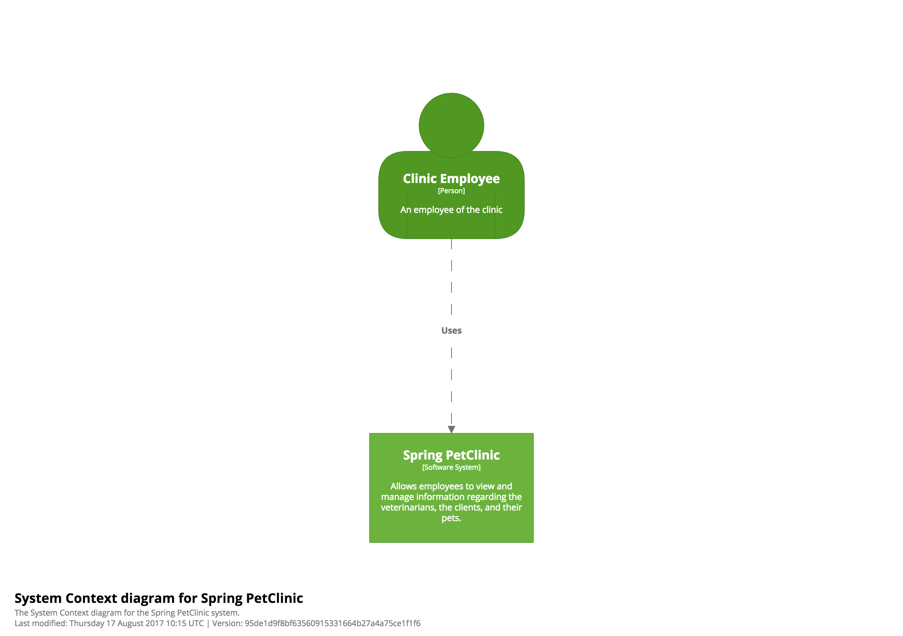
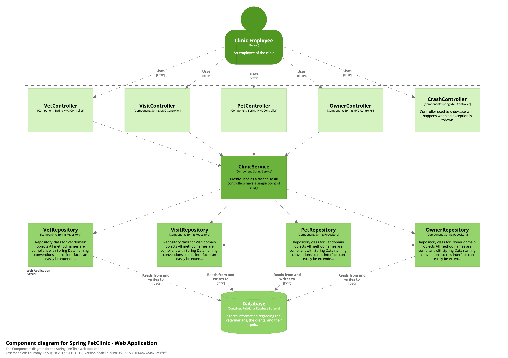
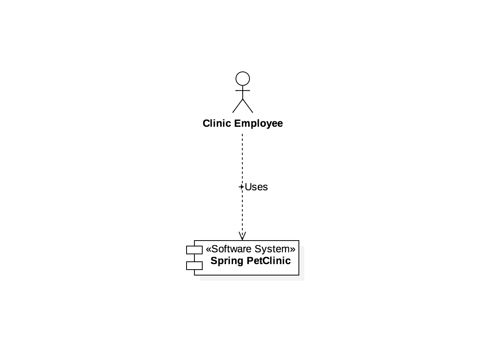

# 표기법(Notation)

C4 모델은 **표기법에 독립적**이며, 특정한 표기법을 규정하지 않습니다. 하지만 시작점으로서 화이트보드, 종이, 스티키 노트, 인덱스 카드 및 다양한 다이어그램 도구에서 잘 작동하는 간단한 표기법은 다음과 같습니다.

그런 다음 색상과 모양을 사용하여 다이어그램을 보완할 수 있습니다. 추가 정보를 더하거나 다이어그램을 더 미적으로 보기 좋게 만들기 위해서입니다. 파란색과 회색 박스1를 사용하는 많은 예시 다이어그램과 도구들을 보실 수 있지만, 이것이 C4 모델에 의해 규정된 것은 **아니며**, 원하는 어떤 색상이든 자유롭게 사용할 수 있습니다!

## 요소

|  |  |
|  |  |

각 박스에는 요소/추상화 타입(`Person`, `Software System`, `Container`, `Component`)이 포함되어 있습니다. 이는 의도적인 결정이며 어떤 추상화 수준이 표시되고 있는지에 대한 모호함을 없애는 데 도움이 됩니다.

## 관계

|  |

## 다이어그램 키/범례

사용되는 모든 표기법은 가능한 한 자기 설명적(self-describing)이어야 하지만, 모든 다이어그램은 표기법을 명시적으로 나타내기 위해 키/범례를 가져야 합니다. 이는 UML, ArchiMate, SysML과 같은 표기법으로 생성된 다이어그램에도 적용됩니다. 모든 사람이 사용된 표기법을 알고 있는 것은 아니기 때문입니다.

## 표기법, 표기법, 표기법

C4 모델이 추상화 우선 접근법이고 표기법에 독립적이지만, 여전히 다이어그램 표기법이 의미가 있고 다이어그램이 이해 가능한지 확인해야 합니다. 이를 생각하는 좋은 방법은 각 다이어그램이 독립적으로 존재할 수 있고, 설명 없이도 (대부분) 이해할 수 있는지 스스로에게 묻는 것입니다. 이 짧은 [소프트웨어 아키텍처 다이어그램 검토 체크리스트](/diagrams/checklist)를 사용해 도움을 받을 수 있습니다.

다음은 표기법과 관련된 일반적인 권장 사항입니다.

### 다이어그램

- 모든 다이어그램은 다이어그램 타입과 범위를 설명하는 제목을 가져야 합니다(예: "My Software System을 위한 시스템 컨텍스트 다이어그램").
- 모든 다이어그램은 사용되는 표기법을 설명하는 키/범례를 가져야 합니다(예: 모양, 색상, 테두리 스타일, 선 타입, 화살표 머리 등).
- 약어와 축약어(비즈니스/도메인 또는 기술)는 모든 독자가 이해할 수 있어야 하거나 다이어그램 키/범례에서 설명되어야 합니다.

### 요소

- 모든 요소의 타입은 명시적으로 지정되어야 합니다(예: Person, Software System, Container 또는 Component).
- 모든 요소는 주요 책임에 대한 "한눈에 보기(at a glance)" 관점을 제공하기 위해 간략한 설명을 포함해야 합니다.
- 모든 컨테이너와 컴포넌트에는 사용된 기술이 명시되어야 합니다.

### 관계

- 모든 선은 단방향 관계를 나타내야 합니다.
- 모든 선은 레이블이 있어야 하며, 레이블은 관계의 방향과 의도(예: 의존성 또는 데이터 플로우)와 일치해야 합니다. "Uses"와 같은 단일 단어를 피하고 가능한 한 레이블을 구체적으로 만들도록 노력하시기 바랍니다.
- 컨테이너 간의 관계(일반적으로 이들은 프로세스 간 통신을 나타냄)는 기술/프로토콜이 명시적으로 레이블 되어야 합니다.

## C4와 UML

예시 다이어그램들이 "박스와 선" 표기법을 사용하여 생성되었지만, 핵심 다이어그램들은 패키지, 컴포넌트, 스테레오타입을 적절히 사용하여 UML로 설명될 수 있습니다. 다만 일부 UML 도구에서는 그러한 텍스트를 추가하는 것이 불가능하거나 어렵기 때문에, 결과적으로 만들어지는 UML 다이어그램은 동일한 수준의 설명 텍스트가 부족한 경향이 있습니다.

다음은 비교를 위한 시스템 컨텍스트, 컨테이너, 컴포넌트 다이어그램의 세 가지 예시입니다.

| 시스템 컨텍스트 다이어그램 | 컨테이너 다이어그램 | 컴포넌트 다이어그램 |
|  |  |  |
|  |  |  |
|  |  |  |

## C4와 ArchiMate

ArchiMate로 C4 모델 다이어그램을 생성하는 방법에 대한 자세한 내용은 [C4 Model, Architecture Viewpoint and Archi 4.7](https://www.archimatetool.com/blog/2020/04/18/c4-model-architecture-viewpoint-and-archi-4-7/)을 참조하시기 바랍니다.

## 대안적 시각화

마지막으로, 항상 전통적인 "박스와 화살표" 다이어그램을 사용해야 한다고 느끼지 마시기 바랍니다. 이것이 보통 기본 접근법이지만, 동일한 C4 모델 추상화를 매우 다른 방식으로 보여줄 수 있는 다른, 종종 인터렉티브한 시각화가 있습니다.

|  |  |  |
| 전통적인 "박스와 화살표" 다이어그램은 문서화와 프레젠테이션을 위한 기본 접근법입니다. | D3.js 강제 지향 그래프는 더 큰 소프트웨어 아키텍처를 시각화하는 매우 간결한 방법이며, 의존성을 탐색하는 쉬운 방법도 제공합니다. | Ilograph의 인터렉티브 다이어그램은 선택적으로 확대 및 축소할 수 있는 방법을 제공하여 전체 소프트웨어 아키텍처 모델을 탐색할 수 있게 해줍니다. |

- 1 "C4 = 파란색과 회색 박스"는 일반적인 오해입니다. 이것이 이 웹사이트에 제시된 예시 다이어그램들이 이제 파란색, 녹색, 빨간색 버전 사이를 순환하는 이유입니다!

